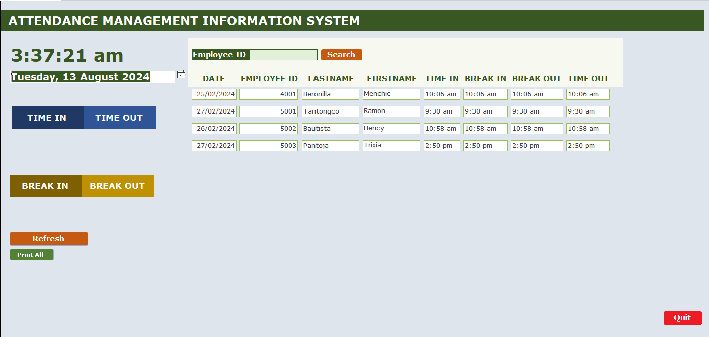

# Attendance Management Information System (AMIS)

## Overview
The Attendance Management Information System (AMIS) is a comprehensive solution built using Microsoft Access for managing employee attendance records. It allows for efficient tracking of time in, time out, break in, and break out times, providing a user-friendly interface for recording and managing attendance data.

## Features
- **Time In/Time Out**: Easily log employee time in and time out.
- **Break In/Break Out**: Track employee break times to maintain accurate attendance records.
- **Employee Search**: Quickly locate and manage records by Employee ID.
- **Real-time Date and Time Display**: View the current date and time for precise timekeeping.
- **Data Refresh**: Instantly update records with the latest attendance information.
- **Print Functionality**: Print all attendance records for offline use.
- **User-friendly Interface**: Navigate through a simple and intuitive layout.

## Screenshots

## How to Use
1. Open the MS Access file.
2. Use the "Employee ID" search function to locate an employee’s record.
3. Record the time in, time out, break in, and break out as needed.
4. Refresh the data to view the latest entries.
5. Use the print option to generate a physical copy of the attendance records.

## Requirements
- **Microsoft Access**: Ensure you have Microsoft Access installed to run the AMIS.

## Contact
For any questions or support, please contact me at menchieberonilla@gmail.com.
